# **SYSTEMSHOCK REHEARSALS**

System shock Rehearsals is a passion project of mine as it is the exact business I would  love to open up myself. Not only a collection of equipment but people too that will make creating any sound of can think of as easily as possible.

The aim is to make the information easily available as possible through a single scrollable website which is accessible on all the most commonly used devices.

[Link](https://eeebeedee.github.io/systemshock_rehearsals/) to deployed site

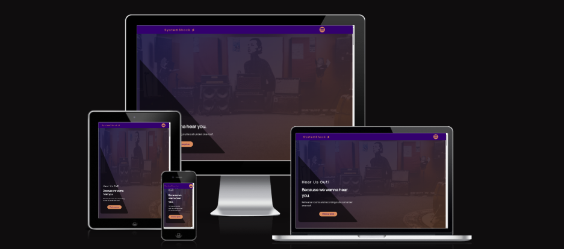

## UX 

### User stories

* #### First time user goals

    * As a first time user, I want to be easily navigate the website
    * As a first time user, I want my viewing experience to be smooth on any device I my use.
    * As a first time user, I want the websites aim and goals to be easily understood and readily available .

* #### Returning user goals

    * As a returning visitor, I want any new deals or equipment available to view.
    * As a returning visitor, I want to be able to get in contact about services advertised or just in general 
    *  As a returning visitor, I want to see new content and general updates about the business and its services

### Design

#### Colour Scheme

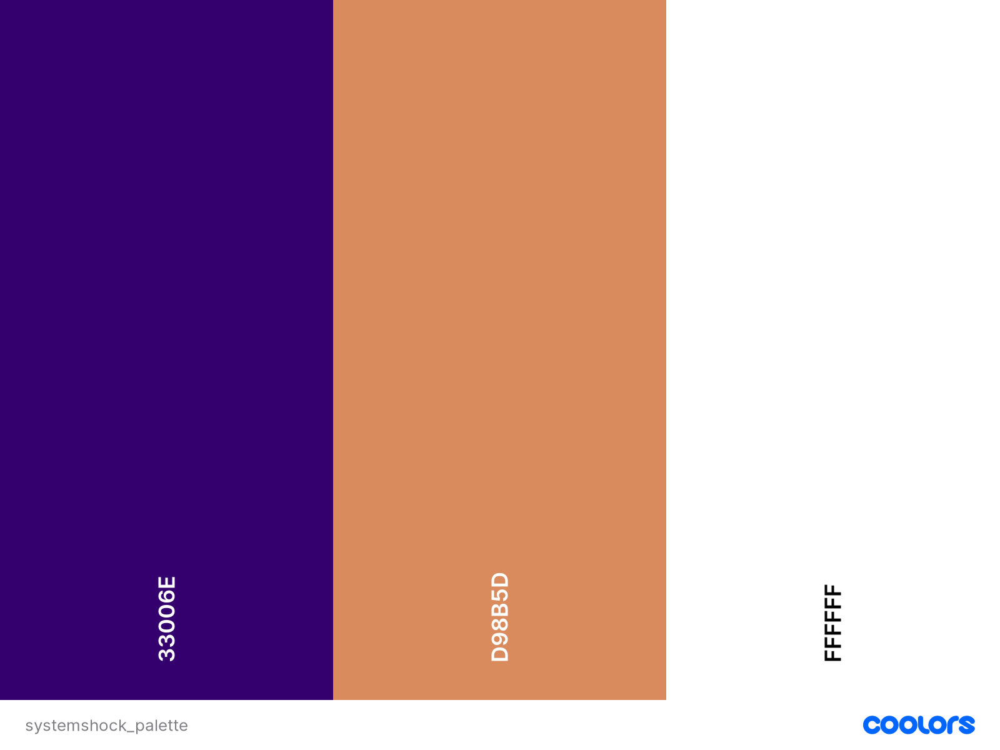

For this project the three main prevalent colours I decided on were Persian Indigo #33006E, Raw Sienna #D98B5D and White #fff.

As the name came first I initally thought of yellow for its connection to lightning thought I found it too bright. With the Raw Sienna colour I found it pops off the screen enough without being distracting.

With the Persian Indigo the approach was similar, I needed a complementary darker colour that I felt had the same characteristics, eye catching without being too overbearing.

#### Typography

For typography I decided to go for a singular font from [Google Fonts](https://fonts.google.com/) called Manrope. With a similar approach to the colour palette I wanted to find font that at first glance was not standard but its appearance wasn't distracting or that it didn't affect readability. 

## Features

### Navbar

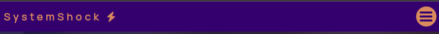
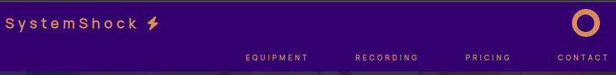

#### For desktop - tablet
- sleek simple design
- logo and name act as link to return to the top of the page
- animated burger menu which brings in links for different sections
- links section automatically close after selected
- uses Javascript for burger menu interaction

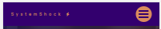
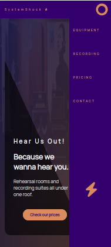

#### For mobile
- same principles as desktop menu
- links section now comes in on right side of screen and takes up full height for ease of use on mobile devices
- also includes logo in the bottom of the now bigger proportioned menu 

### Hero 

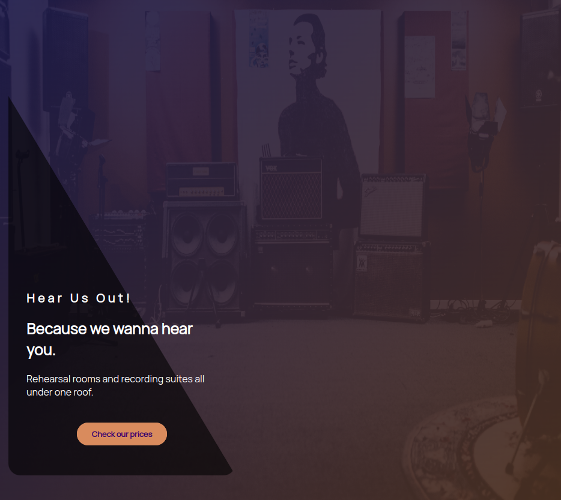

- uses a full screen image with two layers above it. One is a linear-gradient of the two main colours running from the top left to bottom right and another of just black. Using a medium opacity on both to create the effect
- Intro blurb positioned out of the way to let background take center stage
- button drops in a second after the page has loaded to draw the eye into that area
-  for mobile the only change is the text area and its background is given more real estate to help keep all text readable and on a single screen (see below:)

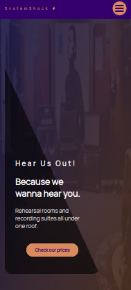

### Equipment

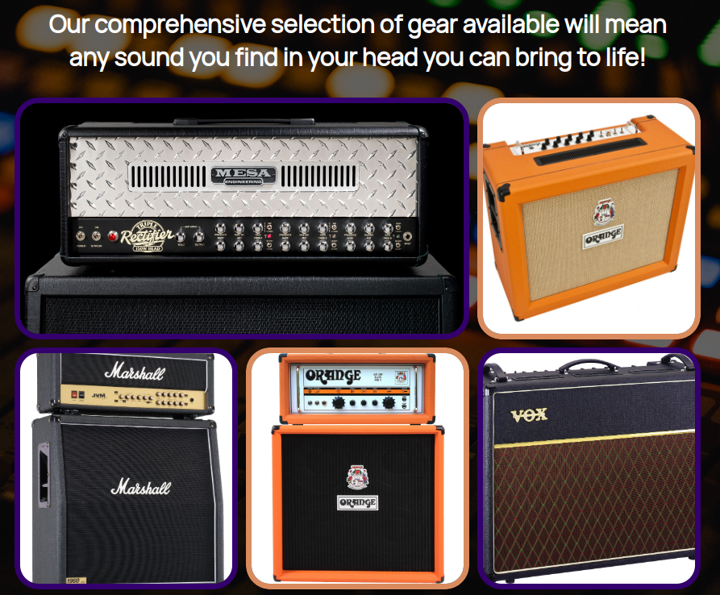
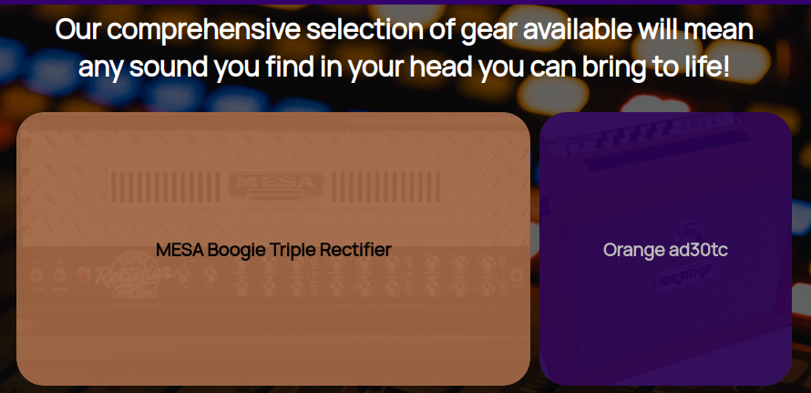

- uses the grid system to display available equipment 
- every second item has a different border and overlay
- when hovered the image darkens and zooms in while an overlay of the opposite color of the border comes up from below with the name of the equipment
- on mobile the only change is the size of the grid rows is changed to 1 to make it easier to view and stop the images distorting (see below:)

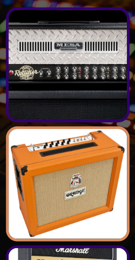

### Pricing 

#### For desktop

- used cards to differentiate between our servicies 
- used flex box to allow an easy staggered effect
- on hover the cards enlarge and the box-shadow grows giving an almost tactile impression

#### For mobile

- flex direction is changed to column to stack divs on top of each other for ease of reacding 
- new shape lends itself to scrolling on small screens better
- images resized to fit new shape better

### Contact

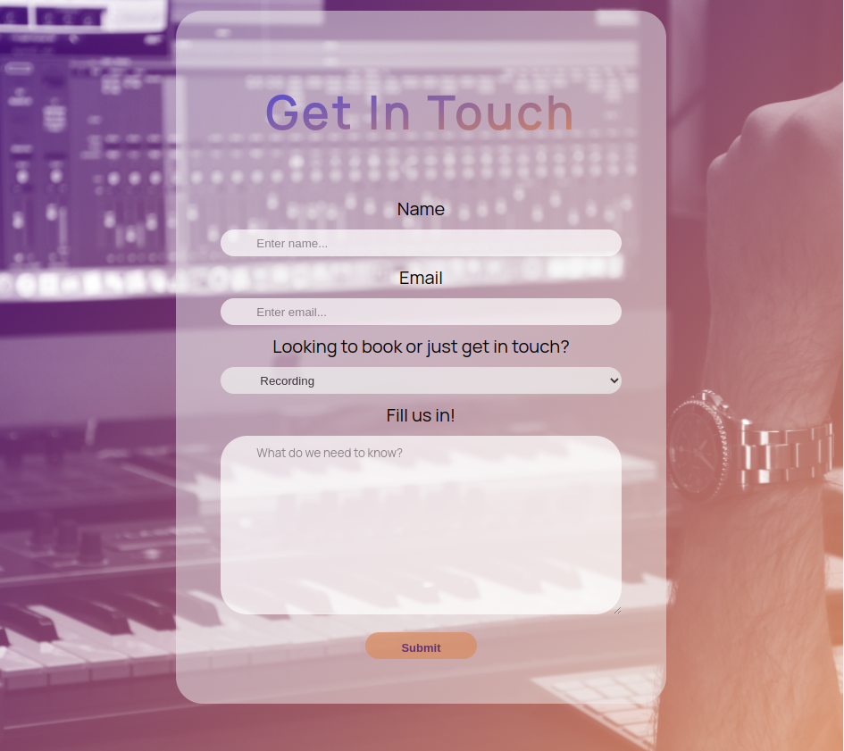

- background uses a linear-gradient of the two primary colours and the property background-blend-mode with the screen value to create the effect
- contact form itself is fully responsive and needed no tweaking between screen sizes

## Technologies Used

### Languages Used

-   [HTML5](https://en.wikipedia.org/wiki/HTML5)
-   [CSS3](https://en.wikipedia.org/wiki/Cascading_Style_Sheets)
-   [Javascript](https://en.wikipedia.org/wiki/JavaScript)

### Tools Used

- [Google Fonts:](https://fonts.google.com/)
    - Google fonts was used to import the 'Manrope' font used throughout the entire website.
- [Font Awesome:](https://fontawesome.com/)
    - Font Awesome was used for the icon in the Navbar.
- [Git](https://git-scm.com/)
    - Git was used for version control and to Push to GitHub.
- [GitHub:](https://github.com/)
    - GitHub is used to store the project's code remotely and then to host the static website on GitHub Pages.
- [VScode](https://code.visualstudio.com/)
    - Vscode was my code editor for this project.

## Testing

Please find all information pertaining to testing in [TESTING.md](TESTING.md)

## Deployment

The site was deployed to GitHub pages. The steps to deploy are as follows: 
  - In the [GitHub repository](https://github.com/EeeBeeDee/systemshock_rehearsals), navigate to the Settings tab 
  - From the source section drop-down menu, select the **Main** Branch, then click "Save".
  - The page will be automatically refreshed with a detailed ribbon display to indicate the successful deployment.

The live link can be found [here](https://eeebeedee.github.io/systemshock_rehearsals/)

### Local Deployment

In order to make a local copy of this project, you can clone it. In your IDE Terminal, type the following command to clone my repository:

- `git clone https://github.com/EeeBeeDee/systemshock_rehearsals.git`

Alternatively, if using Gitpod, you can click below to create your own workspace using this repository.

## Credits

[Tim_nelson](https://tim.2bn.dev/) - My CI mentor who helped keep me focused and whos guidance really made this come together 