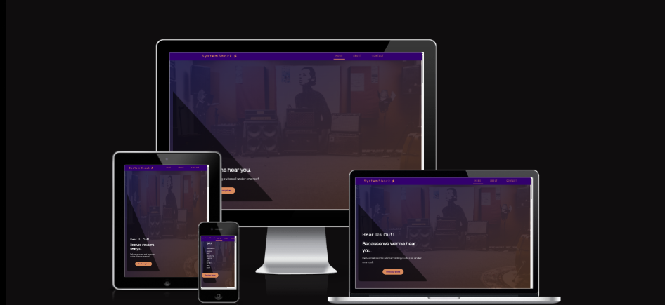
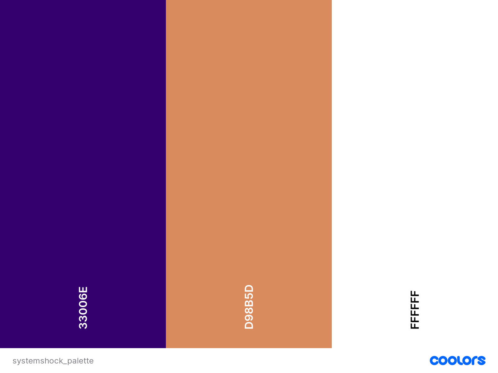

# **SYSTEMSHOCK REHEARSALS**

System shock Rehearsals is a passion project of mine as it is the exact business I would  love to open up myself. Not only a collection of equipment but people too that will make creating any sound of can think of as easily as possible.

The aim is to make the information easily available as possible through a single scrollable website which is accessible on all the most commonly used devices.

## UX 

### User stories

* #### First time user goals

    * As a first time user, I want to be easily navigate the website
    * As a first time user, I want my viewing experience to be smooth on any device I my use.
    * As a first time user, I want the websites aim and goals to be easily understood and readily available .

* #### Returning user goals

    * As a returning visitor, I want any new deals or equipment available to view.
    * As a returning visitor, I want to be able to get in contact about services advertised or just in general 
    *  As a returning visitor, I want to see new content and general updates about the business and its services

### Design

#### Colour Scheme

## Deployment

The site was deployed to GitHub pages. The steps to deploy are as follows: 
  - In the [GitHub repository](https://github.com/EeeBeeDee/systemshock_rehearsals), navigate to the Settings tab 
  - From the source section drop-down menu, select the **Main** Branch, then click "Save".
  - The page will be automatically refreshed with a detailed ribbon display to indicate the successful deployment.

The live link can be found [here](https://eeebeedee.github.io/systemshock_rehearsals/)

### Local Deployment

In order to make a local copy of this project, you can clone it. In your IDE Terminal, type the following command to clone my repository:

- `git clone https://github.com/EeeBeeDee/systemshock_rehearsals.git`

Alternatively, if using Gitpod, you can click below to create your own workspace using this repository.

