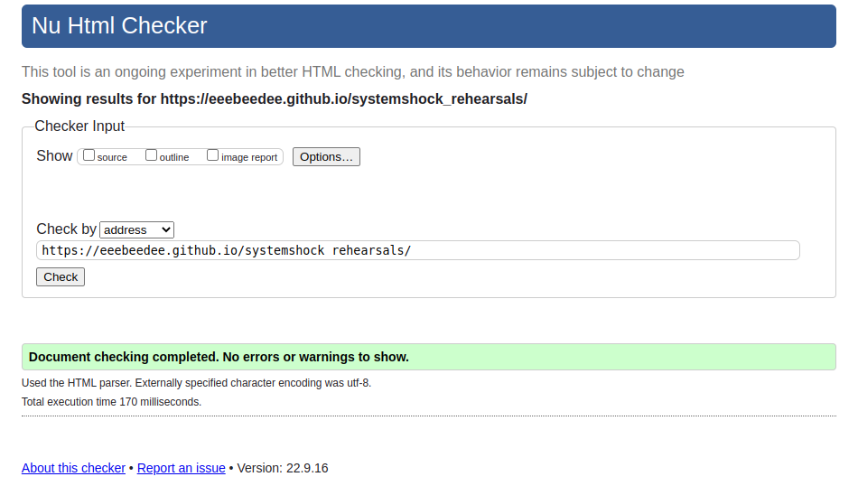
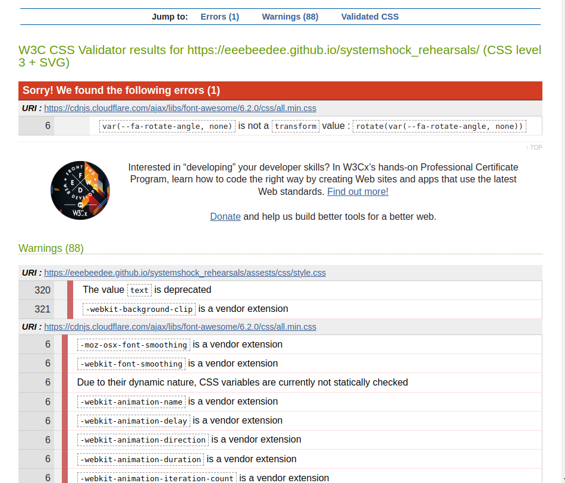
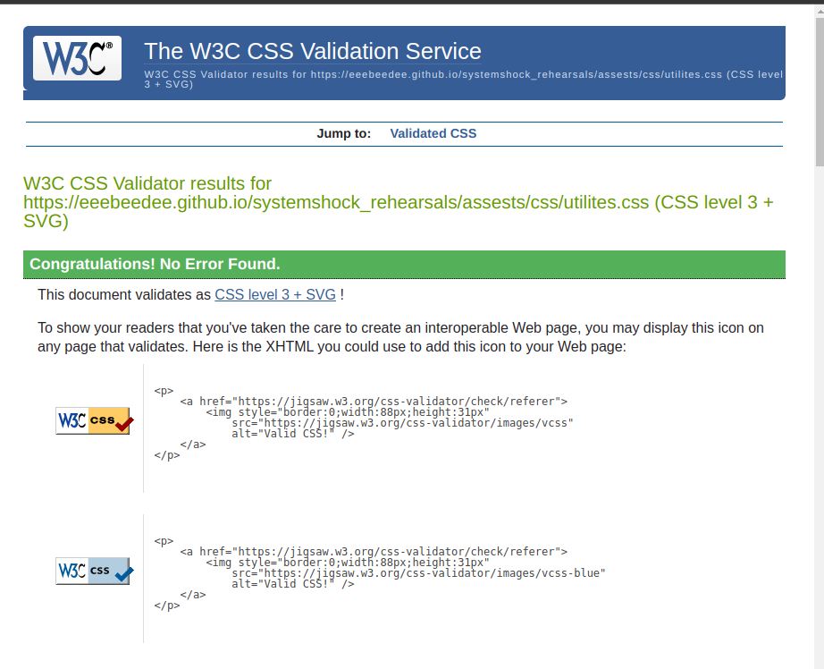
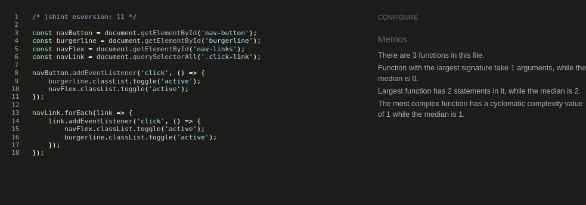
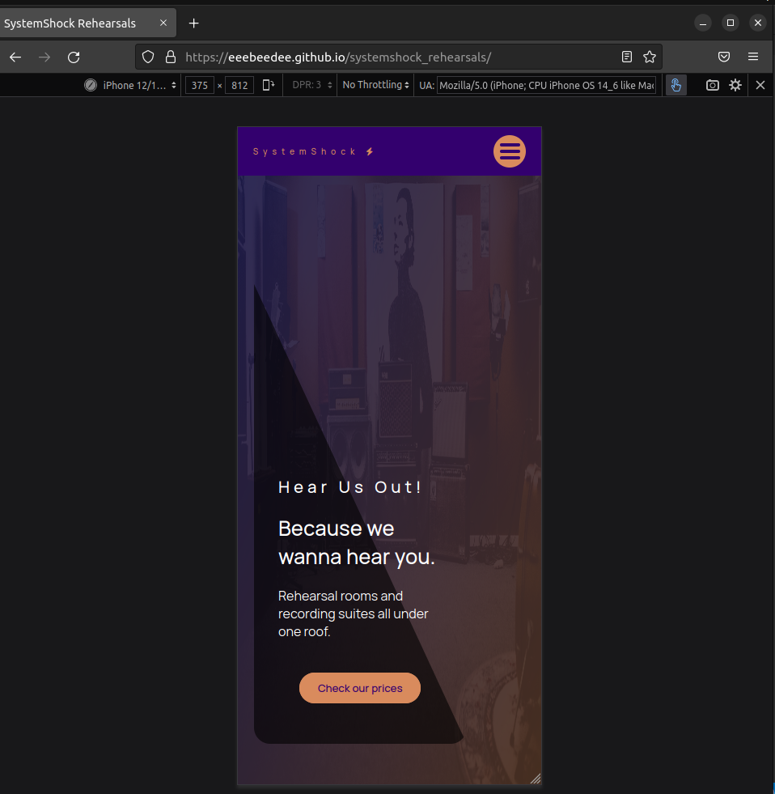

# Testing 

### Code validation 

### HTML

My HTML file showed no warnings or errors when validated

### CSS

The only warning on my own CSS files is for the background-clip attribute with the text property as it is deprecated but to my knowledge is is the only way to get the effect I was looking for. This is in my style.css file

My utilites.css file showed no warnings or errors

All other Warnings and errors are coming from Font Awesomes CSS files

### Javascript

### Lighthouse

The first image is the lighthouse scores for desktop and the second for mobile. Both scored very well across the board.

### Compatibility 

Above are images of the site working on chrome on desktop and firefox with moble dimensions.

Tested to work on all other chromium browers like opera and edge

###