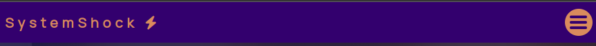
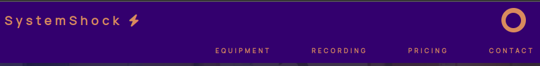
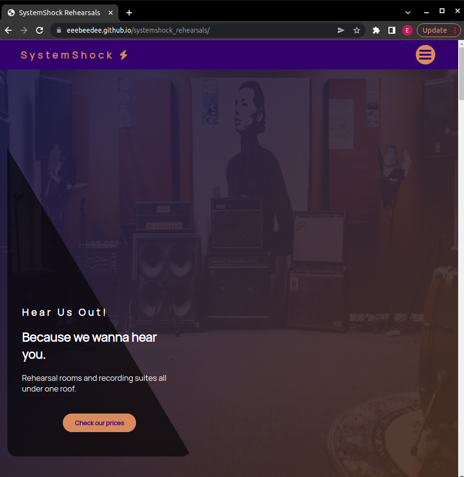
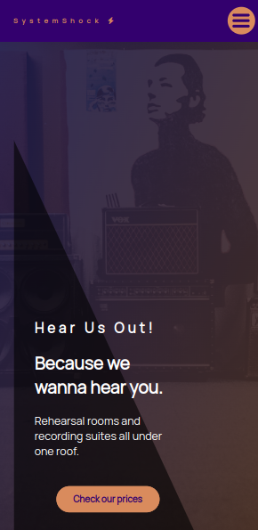
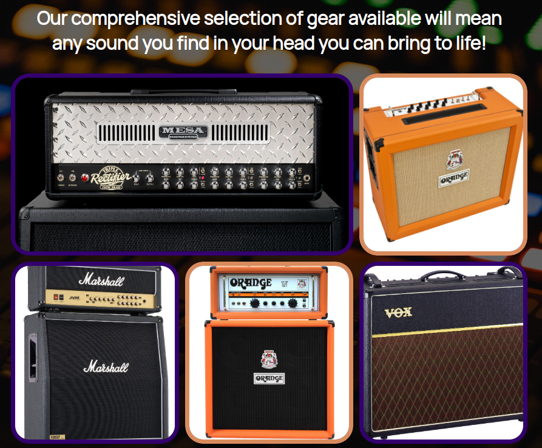
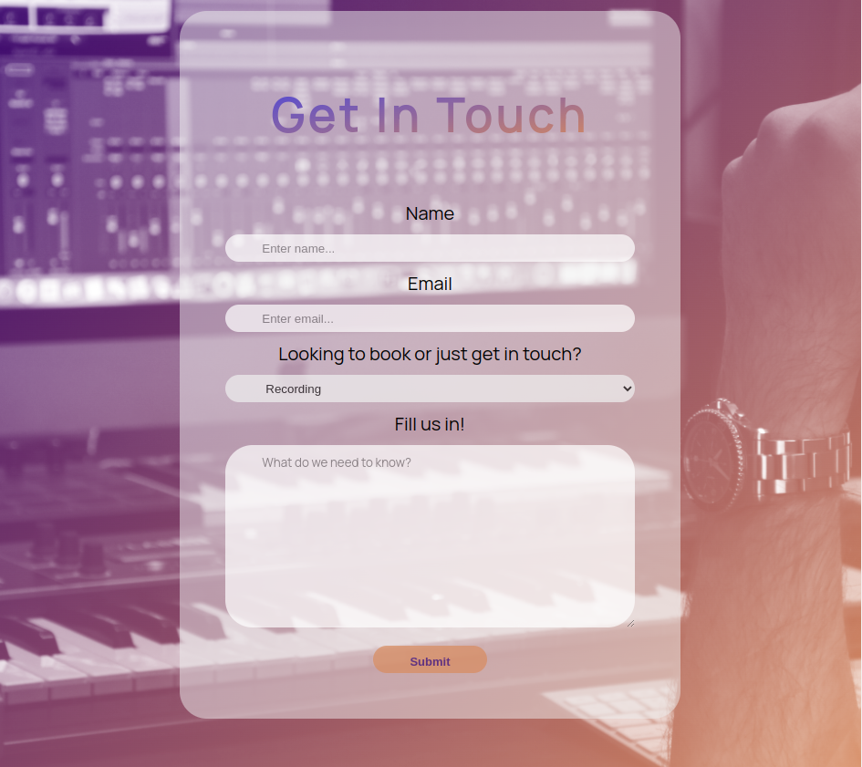

# Testing 

## Code validation 

### HTML

My HTML file showed no warnings or errors when validated

### CSS

The only warning on my own CSS files is for the background-clip attribute with the text property as it is deprecated but to my knowledge is the only way to get the effect I was looking for. This is in my style.css file

My utilites.css file showed no warnings or errors

All other Warnings and errors are coming from Font Awesomes CSS files

### Javascript

My small javascript file just used for navbar functionality showed no errors

### Lighthouse

The first image is the lighthouse scores for desktop and the second for mobile. Both scored very well across the board.

## Testing user stories

 ### First time user goals

* As a first time user, I want to be easily navigate the website:

    * The easy to use navbar achieves this goal.

* As a first time user, I want my viewing experience to be smooth on any device I use.

    * The website is fully responsive from widths of 350px up 

* As a first time user, I want the website's aim and goals to be easily understood and readily available .

    * The hero blurb you see when first landing clearly states what the site offers

 ### Returning user goals

* As a returning visitor, I want any new deals or equipment available to view.

    * The equipment section makes see what equipment is on offer easy and accessible

* As a returning visitor, I want to be able to get in contact about services advertised or just in general 

    * The contact form is found at the bottom of the page and has a dedicated link in the websites fixed navbar also
*  As a returning visitor, I want to see new content and general updates about the business and its services

    * The purpose of the intro blurb area is to be used for the newest updates or news pertaining to Systemshock Rehearsals  

## Compatibility 

Above are images of the site working on chrome on desktop, opera with tablet dimensions and firefox with mobile dimensions.

## Responsiveness

Above are images of the site working in desktop ,tablet and mobile dimensions

## Unfixed bugs 

One Issue that persists that I am aware of is a horizontal scroll bar when you reach widths of a smaller than 300px.

As seen above some of the sections including the navbar exceed 100vw. I spent a small amount of time trying to fix the issue but realised that as we are not marked on sizes that low my time would be better spent elsewhere